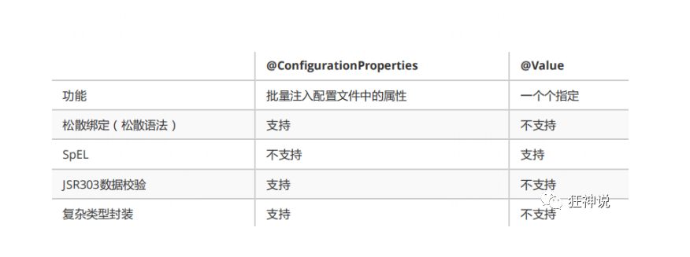
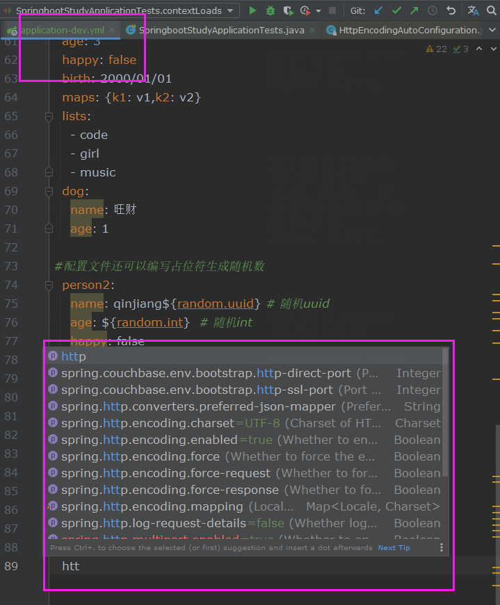
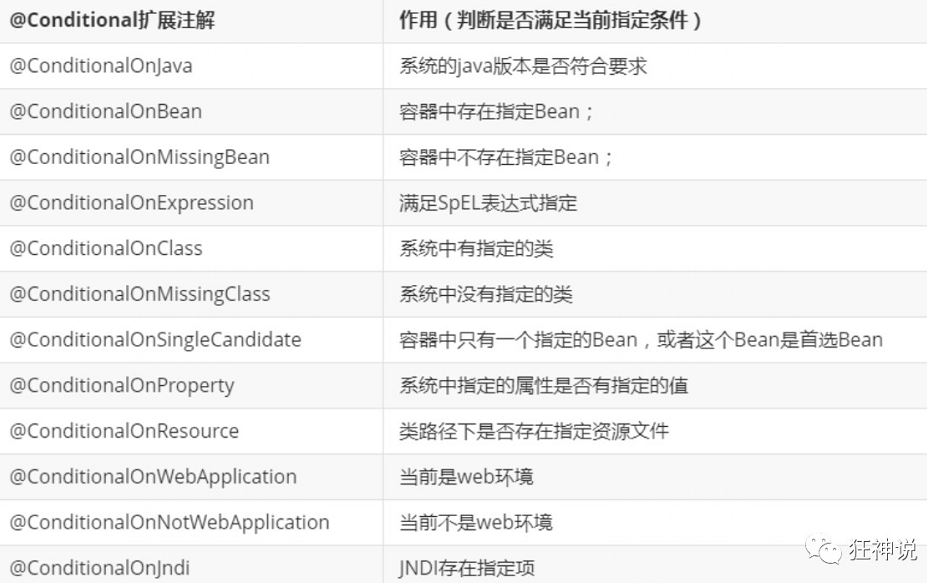

# 1.yaml配置注入



1、@ConfigurationProperties只需要写一次即可 ， @Value则需要每个字段都添加

2、松散绑定：这个什么意思呢? 比如我的yml中写的last-name，这个和lastName是一样的， - 后面跟着的字母默认是大写的。这就是松散绑定。可以测试一下

3、JSR303数据校验 ， 这个就是我们可以在字段是增加一层过滤器验证 ， 可以保证数据的合法性

4、复杂类型封装，yml中可以封装对象 ， 使用value就不支持

**结论：**

配置yml和配置properties都可以获取到值 ， 强烈推荐 yml；

如果我们在某个业务中，只需要获取配置文件中的某个值，可以使用一下 @value；

如果说，我们专门编写了一个JavaBean来和配置文件进行一一映射，就直接@configurationProperties，不要犹豫！

# 2.自动配置原理

## 2.1 HttpEncodingAutoConfiguration

我们以**HttpEncodingAutoConfiguration（Http编码自动配置）**为例解释自动配置原理：

```java

//表示这是一个配置类，和以前编写的配置文件一样，也可以给容器中添加组件；
@Configuration 

//启动指定类的ConfigurationProperties功能；
  //进入这个HttpProperties查看，将配置文件中对应的值和HttpProperties绑定起来；
  //并把HttpProperties加入到ioc容器中
@EnableConfigurationProperties({HttpProperties.class}) 

//Spring底层@Conditional注解
  //根据不同的条件判断，如果满足指定的条件，整个配置类里面的配置就会生效；
  //这里的意思就是判断当前应用是否是web应用，如果是，当前配置类生效
@ConditionalOnWebApplication(
    type = Type.SERVLET
)

//判断当前项目有没有这个类CharacterEncodingFilter；SpringMVC中进行乱码解决的过滤器；
@ConditionalOnClass({CharacterEncodingFilter.class})

//判断配置文件中是否存在某个配置：spring.http.encoding.enabled；
  //如果不存在，判断也是成立的
  //即使我们配置文件中不配置pring.http.encoding.enabled=true，也是默认生效的；
@ConditionalOnProperty(
    prefix = "spring.http.encoding",
    value = {"enabled"},
    matchIfMissing = true
)

public class HttpEncodingAutoConfiguration {
    //他已经和SpringBoot的配置文件映射了
    private final Encoding properties;
    //只有一个有参构造器的情况下，参数的值就会从容器中拿
    public HttpEncodingAutoConfiguration(HttpProperties properties) {
        this.properties = properties.getEncoding();
    }
    
    //给容器中添加一个组件，这个组件的某些值需要从properties中获取
    @Bean
    @ConditionalOnMissingBean //判断容器没有这个组件？
    public CharacterEncodingFilter characterEncodingFilter() {
        CharacterEncodingFilter filter = new OrderedCharacterEncodingFilter();
        filter.setEncoding(this.properties.getCharset().name());
        filter.setForceRequestEncoding(this.properties.shouldForce(org.springframework.boot.autoconfigure.http.HttpProperties.Encoding.Type.REQUEST));
        filter.setForceResponseEncoding(this.properties.shouldForce(org.springframework.boot.autoconfigure.http.HttpProperties.Encoding.Type.RESPONSE));
        return filter;
    }
    //。。。。。。。
}
```

总结：根据当前不同的条件判断，决定这个配置类是否生效。

- 一旦这个配置类生效，该配置类就会跟容器中添加各种组件；
- 这些组件的属性是从对应的properties类中获取的，这些类里面的每个属性又是和配置文件绑定的；
- 所有在配置文件中能配置的属性都是在***Properties类中封装着；
- 配置文件能配置什么就可以参照某个功能对应的这个属性类

```java

//从配置文件中获取指定的值和bean的属性进行绑定
@ConfigurationProperties(prefix = "spring.http") 
public class HttpProperties {
    // ....
}
```

去配置文件试试前缀，看提示！



这就是自动封装的原理！

总结：

- SpringBoot启动会加载大量的自动配置类

- 我们看我们需要的功能有米有在SpringBoot默认写好的自动配置类中；

- 再来看这个自动配置类中到底配置了哪些组件；（只要我们要用的组件存在其中，就不需要再动手配置了）

- 给容器中自动配置类添加组件的时候，会从propeirties类中获取某些属性。我们只需要在配置文件中指定这些属性的值即可。

  XXXXAutoConfiguration：自动配置类；给容器中添加组件

  XXXXProperties:封装配置文件中相关属性

  

## 2.2 @Conditional

自动配置类必须在一定的条件下才能生效。

**Conditional派生注解（Spring注解版原生的@Conditional作用）**

作用：必须是@Conditional指定的条件成立，才给容器中添加组件，配置配里面的所有内容才生效；



这么多的自动配置类，必须在一定的条件下才能生效；也就是说，加载了这么多的配置类，但不是

所有的都生效了。

可以通过启用debug=true属性；来让控制台打印自动生效配置的报告。


```
#开启springboot的调试类
debug=true
```

**Positive matches:（自动配置类启用的：正匹配）**

**Negative matches:（没有启动，没有匹配成功的自动配置类：负匹配）**

**Unconditional classes: （没有条件的类）**

